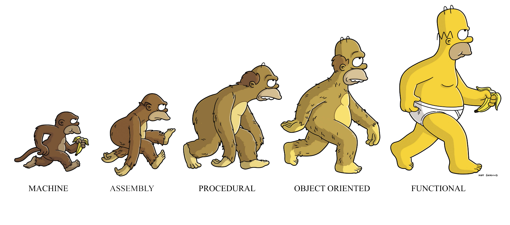

## Hi there 👋

### 🤔 I am a programmer using javascript functional programming 

- OOP 는 Side effect 때문에 에러율이 높은 스타일이며 유닛 테스트에 적합하지 않습니다.
- 아래 그림과 같이 생각 합니다.

- 🔬 테스트 커버리지 100% 이상 문서화 80% 이상 되지 않는 회사는 IT 회사가 아니라고 생각합니다.
- 적당한 이론은 필요하지만 과도한 이론보다 실무를 중요하게 생각합니다.
- Rubber Duck Debugging 🦆
- 모든 것을 끊임없이 도전하고 해결합니다. 
- 못하는 것은 아직 안 한 일일 뿐입니다. 

### 📫 How to reach me

-  [ Go 👉](https://www.notion.so/bichi/Bichikim-s-Document-2e62e9680f244a46afd8611882a9e3bd)

